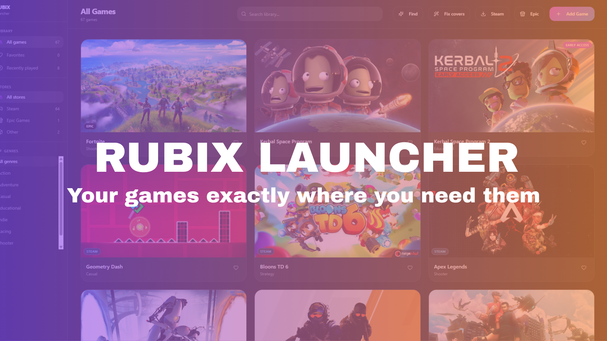
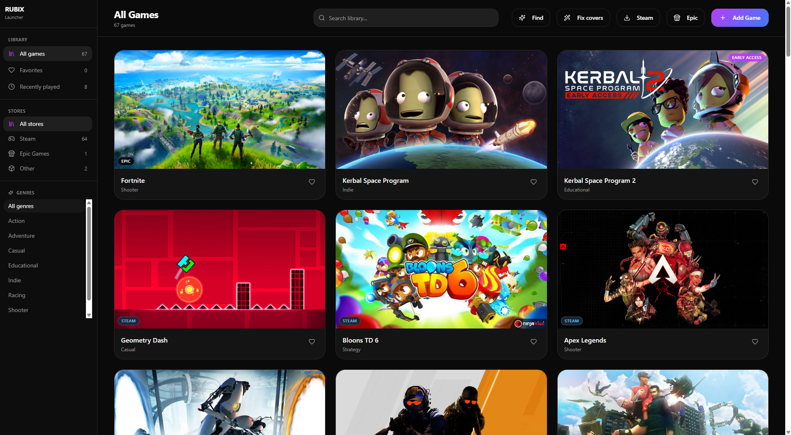
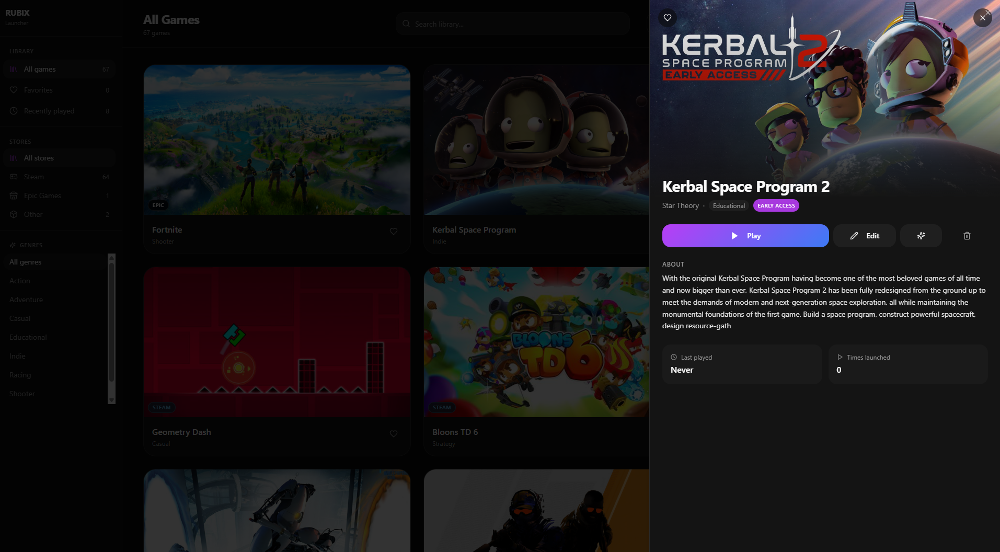
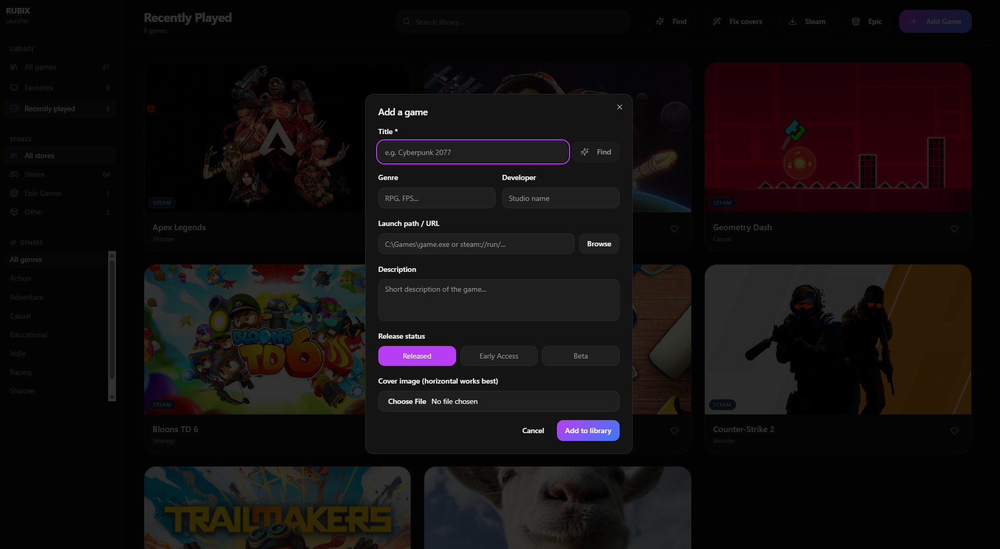
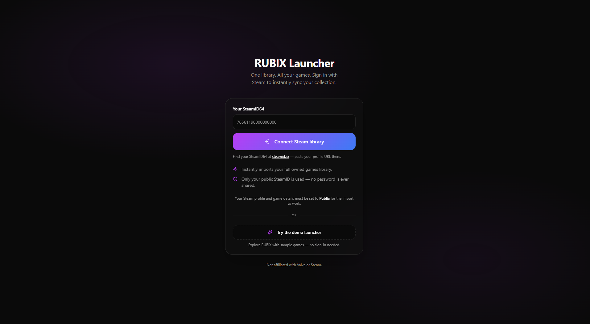

  

<h1 align="center"> Rubix Launcher</h1>

  Your games — exactly where you need them

---

##  About

Made with only the finest **AI slop code**, **Rubix Launcher** is a solution for people who have their game library scattered across multiple launchers.

---

##  Preview

<table align="center" cellspacing="10">
  <tr>
    <td></td>
    <td></td>
  </tr>
  <tr>
    <td></td>
    <td></td>
  </tr>
</table>

---

##  Done

* Steam ID login & library sync
* Epic Games support
* Custom themes
* Auto updates
* Game banners and descriptions 
* EA launcher support
* Built in Steam Friend list
* Built in Spotify
* Rubix Accounts
* General cleanup & polish

---

##  TODO

* Multi-language support
* Built-in theme store
* Website
* Xbox App Support
* Messaging
* Playtime Tracker
* Instant game laucnher from friend list
* In-launcher Steam profiles (no new tab)

---

**This app is still very much in development so any sugetions would be wellcome**
